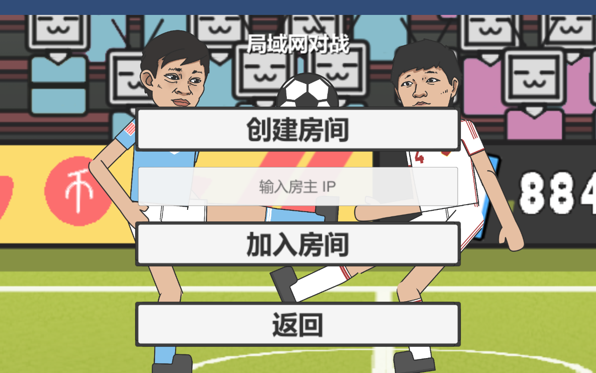
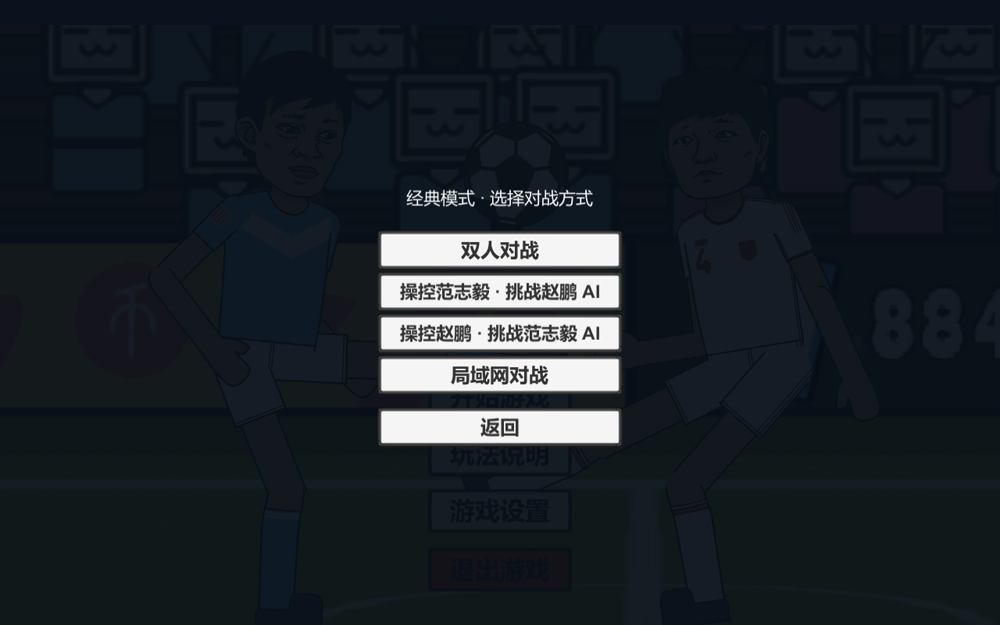

# 局域网对战

此更新为 Windows 32 位原版和模型 75% 实验版加入局域网直连，并同步更新源码和正式游戏 DLL。

## 使用

1. 两台电脑解压同一个游戏包，使用相同的构建版本和玩法。
2. 在两边选择相同的经典／特技模式，再选择“局域网对战”。
3. 房主点击“创建房间”，将页面显示的局域网 IPv4 地址告诉另一位玩家；可点击“复制 IP”。
4. 另一位玩家输入房主 IP，点击“加入房间”。连接成功后自动开赛。

房主操控范志毅，加入者操控赵鹏。房间使用 UDP 28950；Windows 防火墙需要允许游戏在专用网络通信。联机仅提供同一局域网内的直连，没有公网中继。

联机页使用全屏透明布局，保留主菜单球员背景并复用游戏原有的按钮和字体。待机页只显示创建房间、房主 IP 输入、加入房间和返回；地址复制及连接状态在需要时显示。对战方式菜单中的局域网和返回按钮分开排列。断线时显示状态并停止使用过期的远端输入。

## 下载

- [原版 Windows 32 位](downloads/fzy-vs-zp-original-win32.zip)
- [模型 75% 实验版 Windows 32 位](downloads/fzy-vs-zp-experimental-win32.zip)
- [SHA-256 校验值](downloads/SHA256SUMS.txt)
- [逐文件打包清单](downloads/manifest.json)

## 构建

主要构建脚本位于 `范志毅VS赵鹏 PC双人版（32位）/鑼冨織姣匳S璧甸箯 PC鍙屼汉鐗堬紙32浣嶏級/AI Mod Source/build/BuildLanMultiplayer.ps1`。

在 Windows 上使用该脚本：`-Edition Original` 构建原版，`-Edition Experiment` 构建实验版。加入 `-Test` 会建立隔离游戏副本并运行联机回环测试；加入 `-UiTest` 会检查菜单间距、透明布局、分辨率适配和返回／重开流程，并保存游戏内截图。脚本使用 Windows .NET Framework C# 编译器和游戏内附带的 Unity 程序集。

正式构建包含 `LanMultiplayer.cs`；`LanMultiplayerTests.cs` 和 `LanMenuUiTests.cs` 仅加入各自的隔离测试程序集，正式游戏不包含自动测试入口。

## 已完成验证

- 原版和实验版的正式 DLL 编译成功。
- 两版各通过 68 项操作回归和 149 项玩法回归（加入联机功能时完成）。
- 界面更新后，两版各通过 10 项本机 UDP 回环联机检查，包括握手、远端移动／射门输入、比赛启动和主机状态快照。
- 两版各通过 23 项游戏内界面检查，覆盖全屏透明、按钮间距、1280×720／1280×800／800×600 布局、错误提示、房主状态和返回／重开；保存并检查了游戏内截图。
- 完整游戏包与源码游戏目录和实际安装目录逐文件校验一致：原版 146 个文件，实验版 148 个文件。

本机回环检查尚未覆盖两台实体电脑之间的实网对战；网络延迟和多网卡环境仍需要实机验证。
